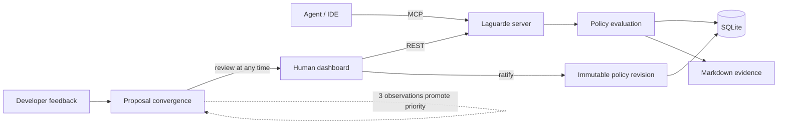

# Laguarde

**Laguarde is a self-hostable policy control plane for AI coding agents.**

It gives a team one persistent place to define engineering practices, evaluate
agent actions, ratify recurring developer preferences, and retain the exact
policy revisions behind important decisions.

Laguarde runs locally for one developer or behind a team URL. Agents interact
with the same server through standard MCP; humans use the dashboard and REST
API.

## What the prototype proves

- Four policy categories: code rules, general guardrails, project
  initialization recipes, and PR review guidelines.
- Four decisions: `allowed`, `limited`, `approval`, and `forbidden`.
- Context-specific policy bundles with immutable revision identifiers.
- Fail-safe action evaluation: an unmatched action is `limited`, not silently
  allowed.
- Human approval for dependency, migration, deletion, and authentication
  actions.
- SQLite decision records plus human-readable Markdown evidence.
- Developer feedback convergence: a human may merge any proposal immediately;
  three observations promote it as a stronger candidate.
- A dashboard for policy CRUD, decision evaluation/review, and feedback
  ratification.

## Quick start

For a local MCP installation, use Node.js 24 or newer:

```bash
npx -y laguarde-mcp@0.2.1
```

Normally your MCP client launches that command as a stdio server. Laguarde
stores its SQLite database and decision evidence in `.laguarde/` in the current
project, and exposes the optional dashboard at <http://localhost:3000>.

Conceptual MCP configuration:

```json
{
  "mcpServers": {
    "laguarde": {
      "command": "npx",
      "args": ["-y", "laguarde-mcp@0.2.1"]
    }
  }
}
```

For repository development, install [Bun](https://bun.sh/) and run:

```bash
bun install
bun run build
bun run start
```

The HTTP MCP endpoint is `http://localhost:3000/mcp`, and agent-facing
discovery is available at <http://localhost:3000/llms.txt>.

Onboarding surfaces:

- human guide: `http://localhost:3000/guide`;
- agent self-setup contract: `http://localhost:3000/install` (`text/plain`).

To onboard a capable agent, send it the `/install` URL and explicitly ask it to
connect Laguarde for the current project. The contract tells it how to verify
the server, make a minimal native MCP configuration change, discover the tools,
and load the default policy bundle.

For S3/CloudFront onboarding, generate the two static upload objects with:

```bash
bun run export:onboarding
```

See [`docs/s3-onboarding.md`](docs/s3-onboarding.md).

MCP Registry publication is automated through GitHub Actions after a one-time
DNS authentication setup. See
[`docs/registry-publishing.md`](docs/registry-publishing.md).

The first start creates `.laguarde/laguarde.db`, seeds an example team context,
and adds ten policies. Set `LAGUARDE_DATA_DIR`, or the more specific
`LAGUARDE_DB_PATH` and `LAGUARDE_EVIDENCE_DIR`, to place persistent data
elsewhere.

## Agent workflow

1. `get_policy_bundle` retrieves the current policies and their revision IDs.
2. `evaluate_action` previews the boundary decision for an exact intended
   action.
3. `record_decision` re-evaluates and persists that action as evidence.
4. The agent proceeds only when allowed, narrows a limited request, waits for
   approval, or stops when forbidden.
5. `list_preference_proposals` and `propose_preference` turn reusable developer
   corrections into a human review queue.

See [usage instructions](docs/usage.md) for tool inputs and concrete calls.

## Architecture



The published CLI uses Node.js, TypeScript, Express, SQLite, and the standard
MCP SDK. Bun remains the repository's development and test runner. Policy types
share one revisioned model, while category-specific configuration is stored in
`fields`.

## Important enforcement boundary

MCP connectivity makes policies discoverable and decisions auditable, but it
does not technically prevent an uncooperative agent from using tools outside
Laguarde. Hard enforcement requires Laguarde decisions to be wired into an
execution hook, command proxy, sandbox, filesystem permissions, or CI gate.

This prototype is therefore an enforceable **decision service**, but only an
advisory boundary until the host agent or execution environment uses it as a
mandatory gate.

## Repository guide

- [`src/`](src/) — policy engine, persistence, REST API, and MCP tools.
- [`public/`](public/) — human dashboard.
- [`llms.txt`](llms.txt) — agent-facing discovery and operating contract.
- [`examples/`](examples/) — bootstrap, control-boundary, and feedback demos.
- [`docs/`](docs/) — installation, usage, decisions, and current limits.
- [`test/`](test/) — executable behavior specification.

## Verification

```bash
bun test
bun run typecheck
bun run build
```

## Next engineering milestones

1. Add authenticated organization/team/project hierarchy and explicit policy
   precedence.
2. Add an execution adapter that verifies approval immediately before an agent
   tool call.
3. Bind approvals to an exact action digest and expiry.
4. Add database migrations and production persistence adapters.
5. Add static code/diff inspection rather than relying only on declared action
   metadata.
